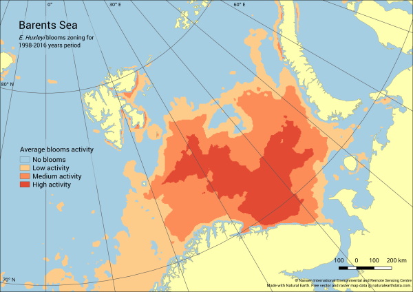

Under guidance of prof. Dmitry Pozdnyakov at NIESRC we conducted large-scale study about coccolithophores blooms and how they affect global climate system. Large satellite dataset for 20 years was collected and processed with authorial algorithms together with in-situ measurements.

We have prepared and published database of calculated blooms. Then we analyzed which factors affects blooms and how it is possible to predict them with machine learning techniques.

More information in papers:

[A synthetic satellite dataset of the spatio-temporal distributions of Emiliania huxleyi blooms and their impacts on Arctic and sub-Arctic marine environments (1998–2016)](https://essd.copernicus.org/articles/11/119/2019/)

[Environmental conditions favoring coccolithophore blooms in subarctic and arctic seas: a 20-year satellite and multi-dimensional statistical study](https://www.spiedigitallibrary.org/conference-proceedings-of-spie/11150/111501W/Environmental-conditions-favoring-coccolithophore-blooms-in-subarctic-and-arctic-seas/10.1117/12.2547868.full?SSO=1)

[Spatial data assimilation with a service-based GIS infrastructure for mapping and analysis of E. Huxleyi blooms in arctic seas](https://www.spiedigitallibrary.org/conference-proceedings-of-spie/10773/107730S/Spatial-data-assimilation-with-a-service-based-GIS-infrastructure-for/10.1117/12.2325127.full)

[Satellite evidence for enhancement of the column mixing ratio of atmospheric CO2 over E. Huxleyi blooms](https://cyberleninka.ru/article/n/satellite-evidence-for-enhancement-of-the-column-mixing-ratio-of-atmospheric-co2-over-e-huxleyi-blooms)