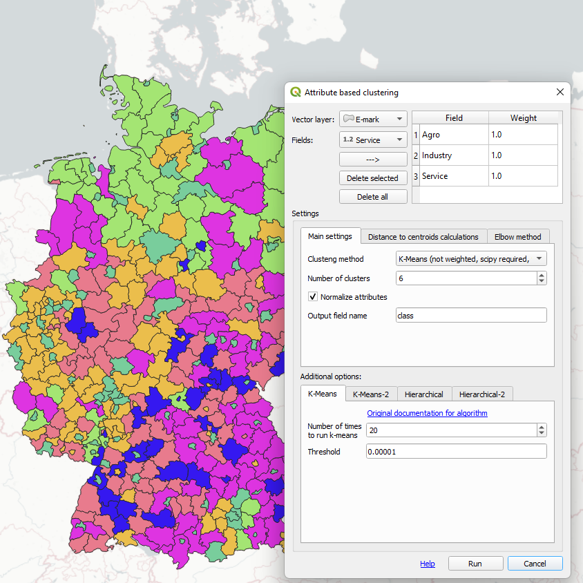

For years around geospatial open-source community I have developed dozens of QGIS and GRASS plugins. Many of them were institution-specific, but some are for general purpose, and they are published in QGIS standard repository.

[Attribute based clustering](https://plugins.qgis.org/plugins/attributeBasedClustering/) is dedicated to problem of objects clustering based on their semantics. Plugins implements hierarchical and K-MEANS algorithms and Elbow method for clusters number optimization. This plugin reached more than 40k downloads.

[Minkowski dimension calculator](https://plugins.qgis.org/plugins/minkowskiDimCalculator/) allows to estimate fractal dimension for vector features. Fractal dimension is interesting characteristic of feature geometry, which can be connected with nature and genesis of geographic object.