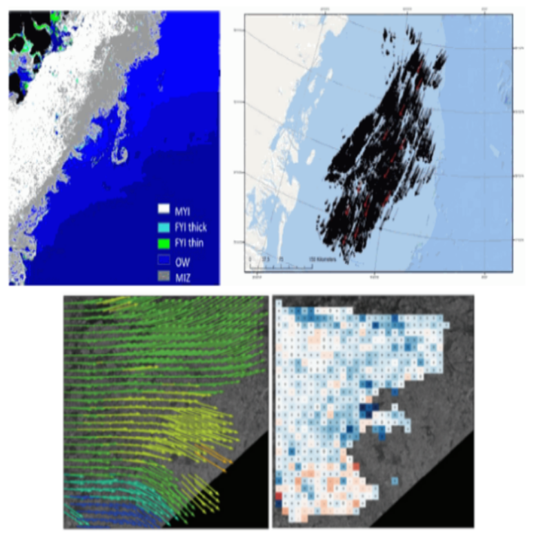

During my work at NIESRC we have developed several algorithms of automated sea ice conditions monitoring and unite them to operative informational system.

Every day sytem downloads new Sentinel-1 SAR data, calculates sea ice classification map, sea ice drift map, detects icebergs and publish maps to [NextGIS Web](https://nextgis.com/nextgis-com/) server GIS.

The unique component of system is our authorial algorithm of precise sea ice drift retrieving.

[Sea Ice Drift Tracking From Sequential SAR Images Using Accelerated-KAZE Features](https://ieeexplore.ieee.org/abstract/document/7938663)