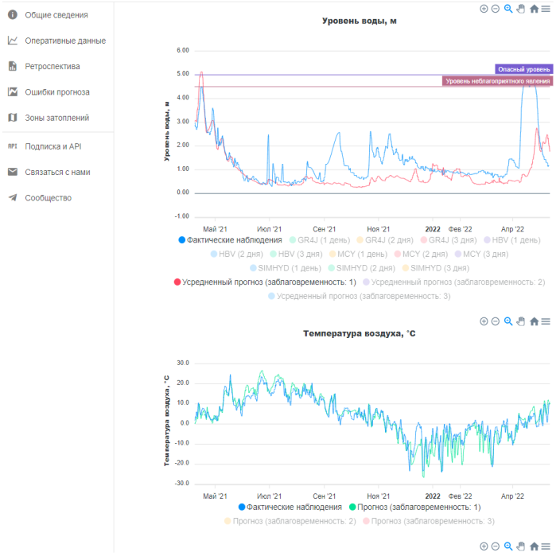

While working in State Hydrological Institute I developed automated system for water levels and discharges forecast at small rivers of North-West Russia.

System is based on opensource models HBV, GR4J and SIMHYD, which were calibrated with machine learning techniques.

WRF forecast was used for precipitation and temperature predictions - they are needed as inputs for hydrological models. 

Public web-frontend provides operative information (forecast for 3 days) and all retrospective data. Also email notifications for dangerous water levels were implemented. 

Some details can be found here: [Automated short-term forecast system based on open-source hydrological models for the Tikhvinka river (Leningrad region of Russia)](https://www.e3s-conferences.org/articles/e3sconf/abs/2020/23/e3sconf_vc2020_02002/e3sconf_vc2020_02002.html)