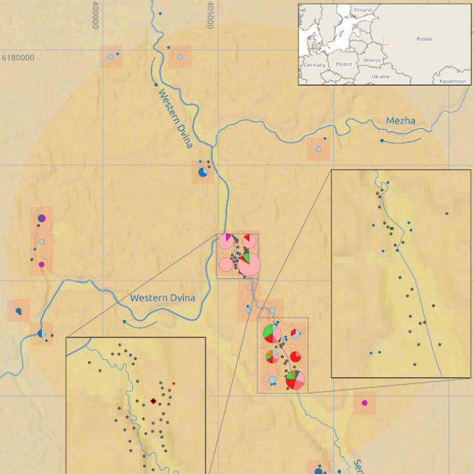

For 8 years I have been supporting archaeological research of Neolithic sites in the North-West of Russia, conducting by State Hermitage, Polish Academy of Sciences and French Academy of Sciences.

My role is to manage all spatial data related problems: from field surveying with UAVs to GIS modeling and maps design. Archaeology is not my speciality, but I have always found very interesting and productive collaboration between historians and geospatialsists.

As an example of my work in this project you can read the article: [PALAEOENVIRONMENTAL RECONSTRUCTIONS FOR THE NEOLITHIC PILE-DWELLING SERTEYA II SITE CASE STUDY, WESTERN RUSSIA](https://journals.ltn.lodz.pl/index.php/Acta-Geographica-Lodziensia/article/view/214/188)