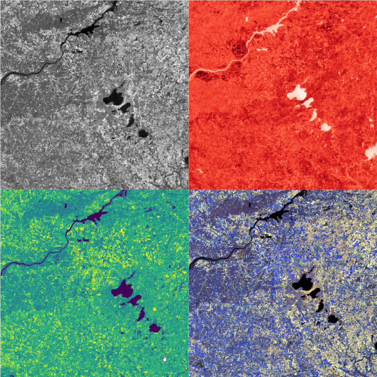

Landsat is very important source of remote sensing data. For many environmental problems we should retrieve geophysical paramaters of Earth’s surface: e.g. surface reflectance, land surface temperature, surface albedo.

Default automated algorithms are not enough for qualitative calculations. So I have implemented advanced ones, described in scientific papers.

[Basic calibration and metadata retrieving](https://github.com/eduard-kazakov/LandsatBasicUtils)

[Atmospheric correction with SREM method](https://github.com/eduard-kazakov/SREMPy-landsat)

[Land surface temperature retrieving with PSWA method](https://github.com/eduard-kazakov/Landsat8_LST_PSWA)

[Land surface albedo retrieving](https://github.com/eduard-kazakov/Landsat8SimpleAlbedo)